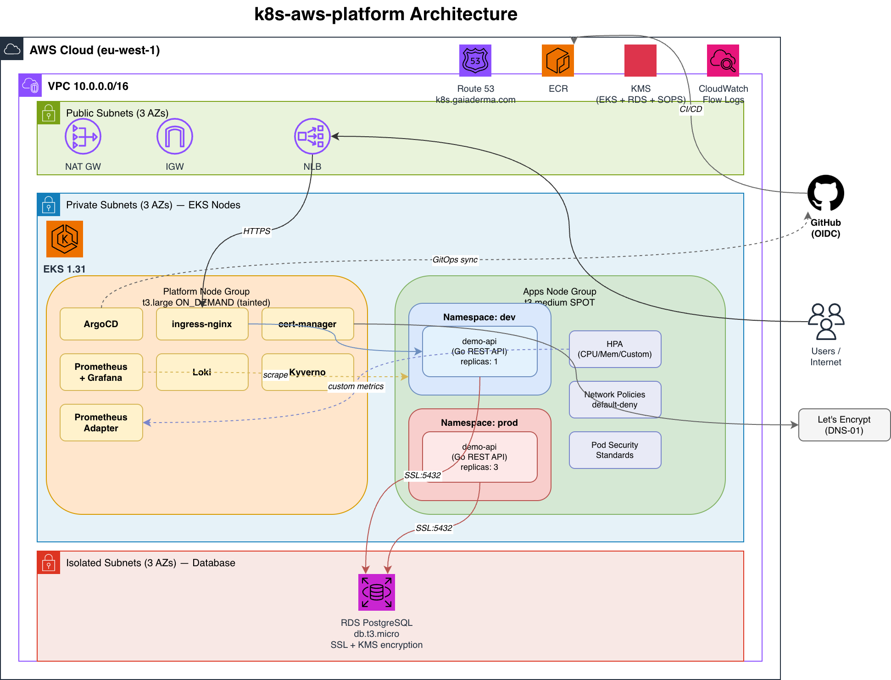
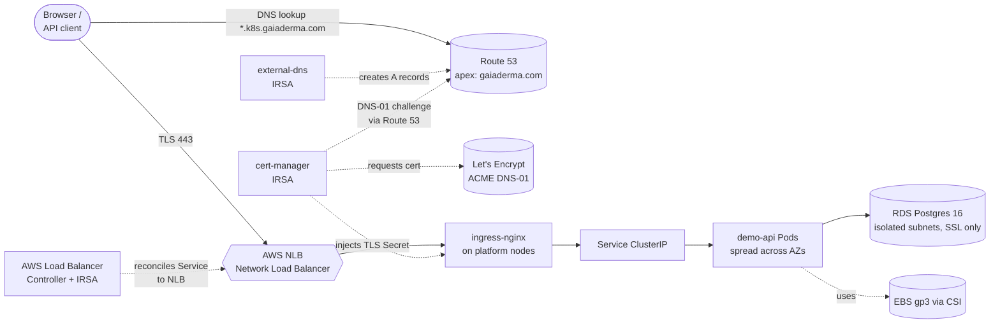
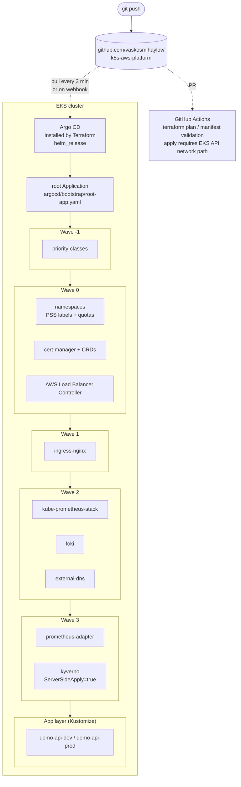
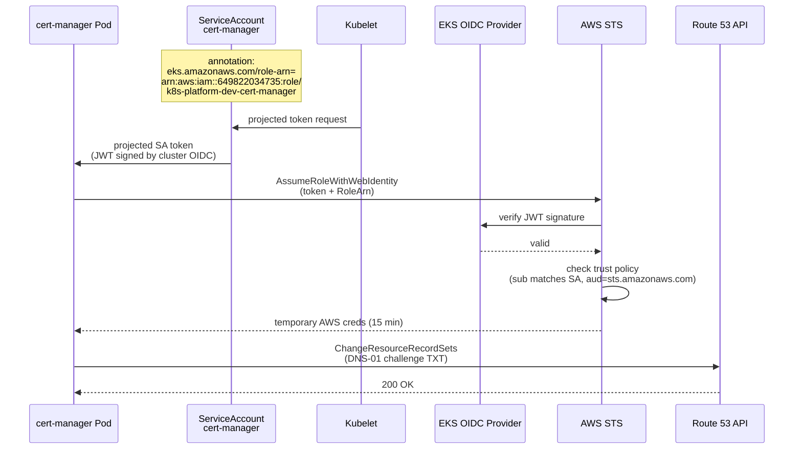
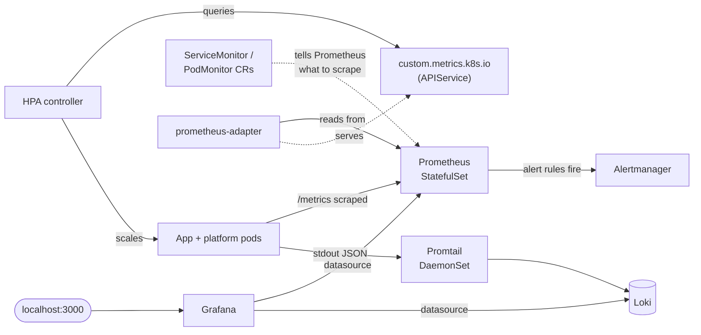

# Architecture

Three views of the same system. Start with the layered diagram for the AWS-and-cluster topology, then read the request path and IRSA flow to understand the dynamics.

## Layered topology (existing draw.io)

!!! note "Static image caveat"
    The PNG is a topology sketch, not an exhaustive inventory. The current live platform also includes
    `aws-load-balancer-controller` and `external-dns`, and Route 53 is an apex `gaiaderma.com` hosted
    zone that serves `*.k8s.gaiaderma.com` records. The Mermaid diagrams below are the more current
    logical view.

Source: `docs/architecture.drawio` — open in [app.diagrams.net](https://app.diagrams.net). The file has **three pages**:

1. **k8s-aws-platform Architecture** (rendered above) — VPC + subnets + EKS node groups + AWS services.
2. **GitOps Sync Waves** — App-of-Apps + wave -1 → 3 ordering.
3. **Request Path + Side Channels** — primary user path with cert-manager and external-dns side-channels.

To re-export the PNG with all three pages: `File → Export as → PNG → All Pages` in draw.io.

## Request path (Mermaid)

Orange-equivalent nodes are AWS-managed (Route 53, NLB, RDS, EBS); the in-cluster path is the simple `user → NLB → ingress → svc → pods`. The dotted arrows are the side-channels — automation that makes the static drawing actually work.

## GitOps sync flow

The invariant: **Argo CD pulls from git, CI never pushes to the cluster**. CI can lose all its AWS creds and the cluster keeps reconciling. See [Argo CD](walkthrough/04-argocd.md) for the wave-by-wave detail.

## IRSA — pod-to-AWS identity flow

This is the AWS killer feature for K8s — covered in [Terraform Foundation](walkthrough/02-terraform.md#irsa) and contrasted with on-prem alternatives in [On-Prem Comparison](operating/onprem-comparison.md).

## Final health snapshot

On 2026-07-07, every Argo CD Application was `Synced`/`Healthy`, no pods were Pending, external-dns
reported records already up to date, and public HTTPS endpoints responded:

| Host | Expected response |
|---|---|
| `argocd.k8s.gaiaderma.com` | HTTP 200 |
| `demo-dev.k8s.gaiaderma.com/readyz` | HTTP 200 |
| `demo.k8s.gaiaderma.com/readyz` | HTTP 200 |
| `grafana.k8s.gaiaderma.com` | HTTP 302 to `/login` |

## Observability data flow

`ServiceMonitor` is the CRD that makes scraping discoverable — apps declare "scrape me on `:8080/metrics`" with a label, and Prometheus picks them up automatically. No reload, no static configs.
