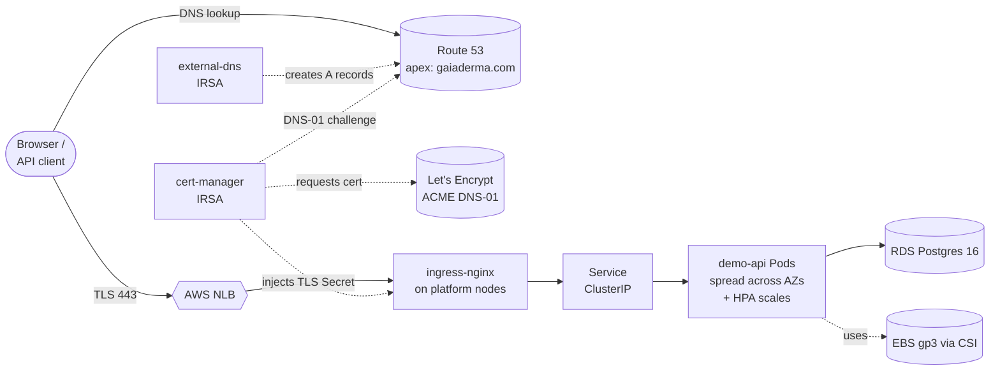

# k8s-aws-platform

AWS EKS showcase platform. Fully bootstrapped, GitOps-managed, observable, policy-enforced, and publicly reachable over TLS.

!!! success "Platform state (2026-07-07)"
    The platform is configured end-to-end. All Argo CD Applications are `Synced`/`Healthy`,
    there are no Pending pods, public DNS resolves through Route 53, TLS works through
    ingress-nginx and cert-manager, and both demo-api readiness endpoints return HTTP 200.

    Terraform applies should currently run from the allowed operator IP. Standard GitHub-hosted
    runners can assume the AWS role, but they cannot reach the EKS API while
    `cluster_endpoint_public_access_cidrs` is locked to a single `/32`. Use a self-hosted runner,
    a larger GitHub runner with static IPs, or a local apply for Kubernetes/Helm-backed Terraform
    resources.

## What this platform is

A **production-shaped 12-factor web service stack on AWS EKS**:

- **Frontend**: ingress-nginx behind an AWS NLB, TLS from Let's Encrypt (DNS-01 via Route 53)
- **App**: Go REST API (`apps/demo-api/`) — `/healthz`, `/readyz`, `/metrics`, `/api/v1/items`
- **State**: RDS PostgreSQL 16, SSL-only, isolated subnets
- **Ops**: Argo CD GitOps, external-dns, AWS Load Balancer Controller, kube-prometheus-stack + Loki + Grafana, HPA on CPU + custom `http_requests_per_second`
- **Policy**: Kyverno 3 ClusterPolicies, Pod Security Standards (`baseline` dev / `restricted` prod), default-deny NetworkPolicies
- **Secrets**: SOPS + AWS KMS via KSOPS plugin in Argo CD repo-server
- **CI/CD**: GitHub Actions via OIDC federation — no long-lived AWS keys

## Reading order

| If you want… | Start here |
|---|---|
| The 30-second pitch | This page |
| The full architecture picture | [Architecture](architecture.md) |
| To trace one layer at a time | [1. Project Shape](walkthrough/01-project-shape.md) → … → [8. Security Story](walkthrough/08-security.md) |
| To understand what's harder without EKS | [On-Prem Comparison](operating/onprem-comparison.md) |
| To click around the running cluster | [Browser Access](operating/browser.md) |
| To know how you'd debug a node without SSH | [Node Troubleshooting](operating/troubleshooting.md) |
| To rebuild from scratch | [AWS Setup Guide](aws-setup-guide.md) |

## Master diagram (request path)



For the layered view with VPC subnets, KMS, ECR, etc., see [Architecture](architecture.md).

## Final live cluster facts

Verified against the live cluster and AWS APIs on 2026-07-07:

| Resource | State |
|---|---|
| Nodes | 2 Ready: one `t3.large` ON_DEMAND platform node and one `t3.medium` SPOT apps node |
| Argo CD Applications | 13 total — all `Synced`/`Healthy`: root, namespaces, priority-classes, cert-manager, ingress-nginx, aws-load-balancer-controller, external-dns, kube-prometheus-stack, loki, prometheus-adapter, kyverno, demo-api-dev, demo-api-prod |
| Pending pods | None |
| StorageClass | `gp3 (default)` via `ebs.csi.aws.com`, **managed in Terraform** (`kubernetes_storage_class_v1.gp3`, imported); legacy `gp2` retained |
| DNS/TLS | `argocd.k8s.gaiaderma.com`, `demo-dev.k8s.gaiaderma.com`, `demo.k8s.gaiaderma.com`, and `grafana.k8s.gaiaderma.com` resolve through Route 53 and serve HTTPS |
| cert-manager / external-dns IRSA | ServiceAccounts assume scoped AWS roles for Route 53 changes |
| Custom metrics API | `v1beta1.custom.metrics.k8s.io` Available, backed by `monitoring/prometheus-adapter` |
| Known caveat | `terraform-aws-eks` ignores managed node group `desired_size` drift after creation; config says apps desired size `2`, live AWS currently reports desired size `1`. This is acceptable while there are no Pending pods, but document it before claiming Terraform manages runtime capacity. |

## Learning map

Each walkthrough page answers one interview-grade question:

| Page | What it teaches |
|---|---|
| [1. Project Shape](walkthrough/01-project-shape.md) | Why platform/config and app source live in separate repos. |
| [2. Terraform Foundation](walkthrough/02-terraform.md) | Remote state, S3 locking, thin modules, IRSA, Route 53, and Terraform caller identity pitfalls. |
| [3. EKS Shape](walkthrough/03-eks.md) | Endpoint exposure, node groups, IMDSv2, VPC CNI, EBS CSI, and the nodegroup desired-size caveat. |
| [4. Argo CD](walkthrough/04-argocd.md) | Terraform bootstrap, app-of-apps, sync waves, multi-source Helm, and KSOPS. |
| [5. Platform Layer](walkthrough/05-platform.md) | ingress-nginx + NLB, AWS Load Balancer Controller, cert-manager, external-dns, Prometheus, Loki, adapter, and Kyverno. |
| [6. App Layer](walkthrough/06-app.md) | Kustomize overlays, SOPS secrets, probes, HPA, PodMonitor, PSS, NetworkPolicy, and PriorityClasses. |
| [7. CI/CD](walkthrough/07-cicd.md) | GitHub OIDC, Terraform Plan/Apply, manifest validation, app image publishing, and why hosted runners cannot apply Kubernetes-backed resources here. |
| [8. Security Story](walkthrough/08-security.md) | The defense-in-depth narrative tying AWS, Kubernetes, GitOps, admission, network, and supply-chain controls together. |

## Running this site locally

```bash
pip install mkdocs-material pymdown-extensions
make docs-serve     # http://localhost:8000
make docs-build     # static site -> site/
```
