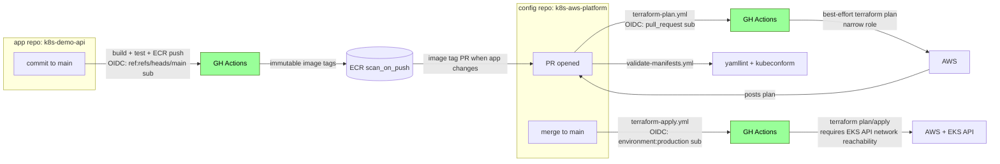

# 7. CI/CD

Three workflows in this repo, two AWS OIDC roles, and one deliberate network boundary.

## Flow



## Workflows in this repo

### `terraform-plan.yml`

- **Trigger**: PR touching `terraform/**`
- **OIDC sub**: `repo:<org>/k8s-aws-platform:pull_request`
- **Role variable**: `AWS_ROLE_ARN`
- **What**: `terraform fmt`, `init`, `validate`, `plan`, then PR comment with the plan output
- **Caveat**: this intentionally uses the narrower role. A full remote plan still needs both
  sufficient read permissions and network reachability to the EKS API.

### `terraform-apply.yml`

- **Trigger**: push to `main` touching Terraform or the workflow; manual `workflow_dispatch`
- **OIDC sub**: `repo:<org>/k8s-aws-platform:environment:production`
- **Role variable**: `TERRAFORM_AWS_ROLE_ARN`
- **What**: `terraform init`, `plan`, `apply`
- **Current caveat**: standard GitHub-hosted runners can assume the AWS role, but cannot reach the
  Kubernetes API while the EKS public endpoint is allowlisted to the operator `/32`.

That caveat is intentional. Do not allowlist the broad GitHub Actions IP ranges just to make this
workflow green. For Kubernetes/Helm-backed Terraform resources, use one of:

1. local apply from the allowed IP,
2. a self-hosted runner in the VPC or private network path,
3. a GitHub larger runner with static IP ranges, then allowlist only those static ranges.

### `validate-manifests.yml`

- **Trigger**: PR
- **What**: `yamllint` + `kubeconform` against manifests in `argocd/`, `platform/`, and `apps/`
- **AWS access**: none

## App repo flow

`k8s-demo-api` is a separate repo and should stay app-focused:

1. App commit triggers build.
2. Tests run in the app repo.
3. Multi-stage Dockerfile produces a distroless, non-root image.
4. Image is pushed to ECR.
5. A config PR updates the image tag in this repo.
6. Argo CD pulls the merged config and rolls the deployment.

## Two OIDC roles, scoped by purpose

Role ARNs are GitHub repository variables because ARNs are not secrets. The trust policy and IAM
permissions are the actual security boundary.

### Terraform role

`TERRAFORM_AWS_ROLE_ARN = arn:aws:iam::649822034735:role/k8s-platform-dev-terraform-github-actions`

Trust policy accepts:

```json
{
  "StringEquals": {
    "token.actions.githubusercontent.com:aud": "sts.amazonaws.com"
  },
  "StringEquals": {
    "token.actions.githubusercontent.com:sub": "repo:<org>/k8s-aws-platform:environment:production"
  }
}
```

Permissions: broad Terraform permissions for this demo account plus an EKS access entry and
cluster-admin policy association for Kubernetes provider auth. That is acceptable for a solo
interview lab, but in shared production you would split state/workspaces and reduce permissions.

### App/ECR role

`AWS_ROLE_ARN = arn:aws:iam::649822034735:role/k8s-platform-dev-github-actions`

Trust policy accepts the app repo main branch plus config-repo PR subjects. Permissions are narrow:
ECR push, S3 state object access where needed, and EKS describe.

!!! note "Interview answer"
    The point is not "CI can deploy." The point is "CI gets short-lived, claim-scoped credentials
    without static AWS keys." Network reachability to the EKS API is a separate control, and this
    project keeps it separate.

## Upstream docs to read

- [GitHub OIDC with AWS](https://docs.github.com/actions/security-for-github-actions/security-hardening-your-deployments/configuring-openid-connect-in-amazon-web-services) — how `id-token: write` becomes AWS credentials.
- [aws-actions/configure-aws-credentials](https://github.com/aws-actions/configure-aws-credentials) — workflow-side role assumption.
- [GitHub-hosted runner IP addresses](https://docs.github.com/en/actions/reference/runners/github-hosted-runners#ip-addresses) — why standard runner IP ranges are not a good allowlist.
- [Managing larger runners](https://docs.github.com/en/actions/how-tos/manage-runners/larger-runners/manage-larger-runners#creating-static-ip-addresses-for-larger-runners) — static IP ranges for larger runners.
