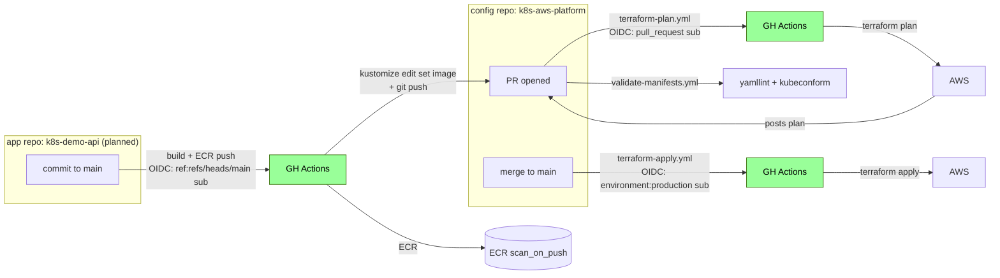

# 7. CI/CD

Three GitHub Actions workflows in this repo, three OIDC sub forms, one shared IAM role.

## Flow



## Workflows (in this repo)

### `terraform-plan.yml`

- **Trigger**: PR
- **OIDC sub**: `repo:<org>/k8s-aws-platform:pull_request`
- **What**: `terraform init && terraform plan`, posts plan as PR comment

### `terraform-apply.yml`

- **Trigger**: push to `main`
- **OIDC sub**: `repo:<org>/k8s-aws-platform:environment:production` (declares `environment: production`)
- **What**: `terraform init && terraform apply`

### `validate-manifests.yml`

- **Trigger**: PR
- **What**: `yamllint` + `kubeconform` against all manifests in `argocd/`, `platform/`, `apps/`
- No AWS access needed — no OIDC

## App repo flow (planned)

When `k8s-demo-api` lands:

1. App commit triggers build
2. Multi-stage Dockerfile produces distroless, non-root image
3. Image pushed to ECR (scan-on-push, lifecycle keeps last 10)
4. Workflow opens PR against this repo: `cd apps/demo-api/overlays/dev && kustomize edit set image demo-api=<ECR_URL>:<TAG>`
5. PR merge triggers Argo CD sync → pods roll

## Single OIDC role, multiple sub forms

One GitHub Environment (`production`). `AWS_ROLE_ARN` is a **repo-level GitHub variable** (not a secret — ARNs aren't sensitive).

The IAM role's trust policy accepts:

```json
{
  "StringEquals": {
    "token.actions.githubusercontent.com:aud": "sts.amazonaws.com"
  },
  "StringLike": {
    "token.actions.githubusercontent.com:sub": [
      "repo:<org>/k8s-aws-platform:environment:production",
      "repo:<org>/k8s-aws-platform:pull_request",
      "repo:<org>/k8s-demo-api:ref:refs/heads/main"
    ]
  }
}
```

!!! note "Interview elegance"
    Three workflows, three sub forms, one shared role — no long-lived AWS keys anywhere. The trust relationship is what limits blast radius.
